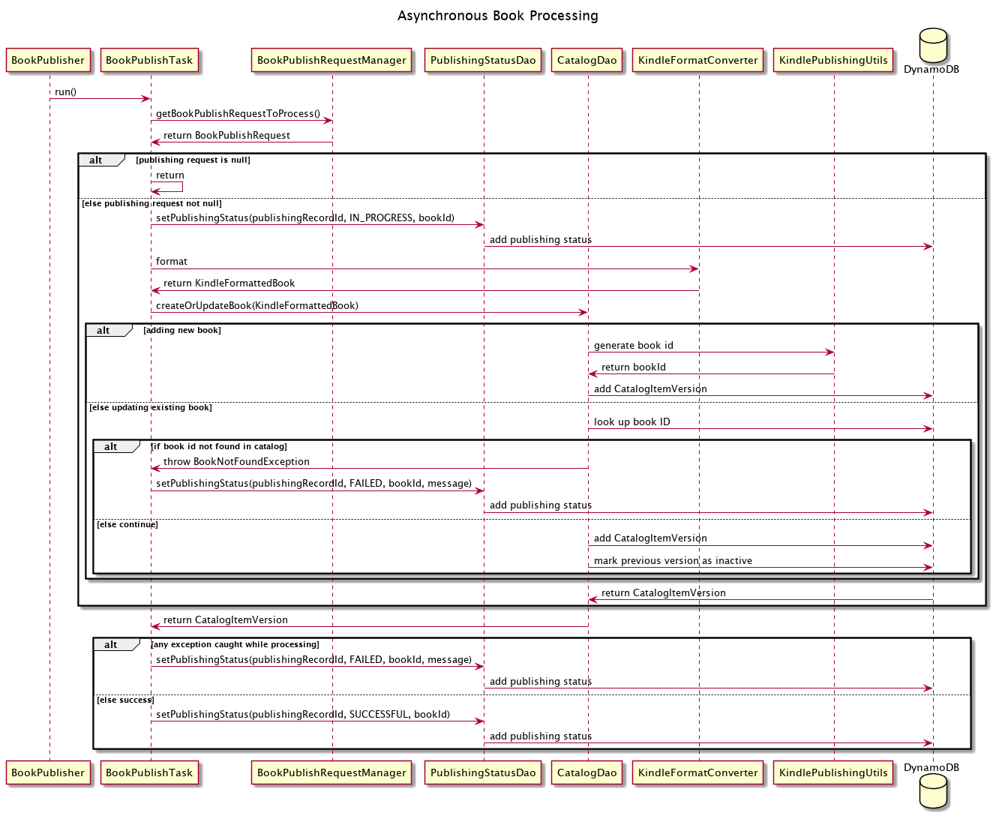

## Kindle Publishing Service

This app provides a service allowing client to publish books to a catalog, access 
published books in the catalog, and remove published books.

A feature is added to retrieve recommendations related to a book request and check 
status of book publishing submission.

* Dagger framework provides dependency injection
* ConcurrentLinkedQueue and asynchronous API calls with multi threading
* AWS Cloudformation and DynamoDB create collection tables and store data
* AWS ECS deploys and runs the service

### Architecture
* User connects to Publishing Client
* Client makes API calls to Publishing Service first connecting to AWS load balancer
* Load balancer forwards request to ECS
* ECS connects to DynamoDB for data

Used Docker to get create a container getting familiar with the application running in an isolated environment
before using AWS ECS to deploy and run the service.

## Publishing Service API Implementation

* `GetBookActivity` communicates with `CatalogDao` that communicates with the `CatalogItemVersions` table, as well as
  a `RecommendationServiceClient` that communicates with the `RecommendationService`
* `PublishingStatusDao` sets the publishing status of a book publish request
* `KindlePublishingUtils` helps with generating `bookIds`, `publishingRecordIds`, and a publishing status message 
* Custom exceptions `BookNotFoundException` created 

### Catalog Versioning

When a book is updated, all previous versions are preserved in catalog with a DynamoDB table `CatalogItemVersions` 
which has a version number for sort key and boolean field `inactive` to indicate the latest active version.

## Endpoints 
### `GetBook`

* Retrieves latest active version of a book from the catalog with a given book id
* Returns list of book recommendations related to the book retrieved from the`RecommendationService`
* Returns book only if the book is currently active
* `BookNotFoundException` thrown when given book id is not found or not active in catalog

### `RemoveBookFromCatalog`

* Removes book from the catalog with a given book id
* Deactivates latest version of book in the `CatalogItemVersions` table by changing `inactive` attribute to `true`
* `BookNotFoundException` thrown when given book id is not found or is `inactive`

### `SubmitBookForPublishing`

* Accepts book assets and submits book for processing
* Updates existing book with book’s associated `bookId`
    * `bookId` is validated and `BookNotFoundException` is thrown
* If `bookId` is not present in request, then submission will be considered for a new
  book, and a new `bookId` will be generated when book is published
* Inserts a book publishing request into the `BookPublishRequestManager` for asynchronous processing
* Adds a record into the `PublishingStatus` table with publishing state `QUEUED`
* Returns a generated `publishingRecordId` associated with the submission
* If book submission is missing the `title`, `author`, `language`, `genre`, or `text`, a
  `ValidationException` will be thrown
  a `ValidationException` will be thrown. You do not have to account for this.

### `GetPublishingStatus`

* Accepts a `publishingRecordId` and returns publishing status history of book submission from `PublishingStatus` table
* A successful publishing request starts in the `QUEUED` state, transitions to `IN_PROGRESS`, and end in `SUCCESSFUL`
* A failed publishing request starts in the `QUEUED` state, transitions to `IN_PROGRESS`, and end in `FAILED`
* When a `SUCCESSFUL` `PublishingStatus` has been reached, the `PublishingStatusRecord` will contain a `bookId` 
* `PublishingRecordFoundException` is thrown when provided `publishingRecordId` is not found in `PublishingStatus` table

## Asynchronous Book Publishing

When App starts up, a call is made to `BookPublisher`. This schedules a
`Runnable` to execute repeatedly while the service runs.

The `Runnable` retrieves a book publish request from `BookPublishRequestManager` and
perform the steps required for publishing a book into the catalog. For each
`BookPublishRequest` in the queue, the following steps are performed:

1. Adds an entry to the Publishing Status table with state `IN_PROGRESS`
2. Performs formatting and conversion of the book
3. Adds the new book to the `CatalogItemVersion` table
  1. If this request is updating an existing book:
    1. The entry in `CatalogItemVersion` will use the same `bookId` but with the
       version incremented by 1.
    1. The previously active version of the book will be marked inactive.
  2. Otherwise, a new `bookId` is generated for the book and the book will be stored in
     `CatalogItemVersion` as version 1.
4. Adds an item to the Publishing Status table with state `SUCCESSFUL` if all the processing steps
   succeed. If an exception is caught while processing, adds an item into the Publishing Status
   table with state `FAILED` and includes the exception message.

*[PlantUML source for diagram](https://tiny.amazon.com/1dasbgpgn/processing)*
